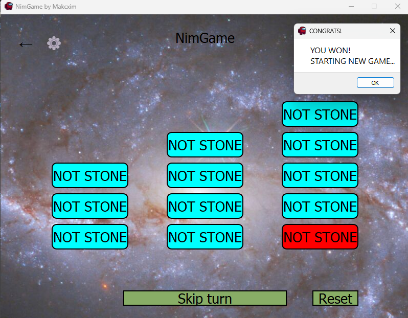
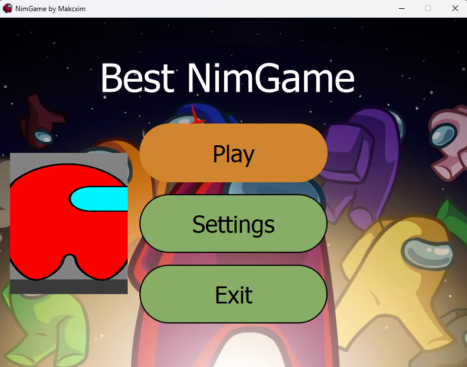
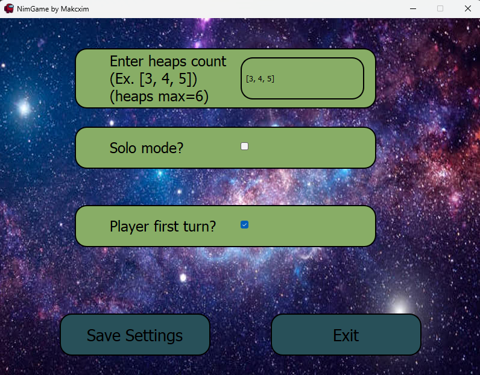
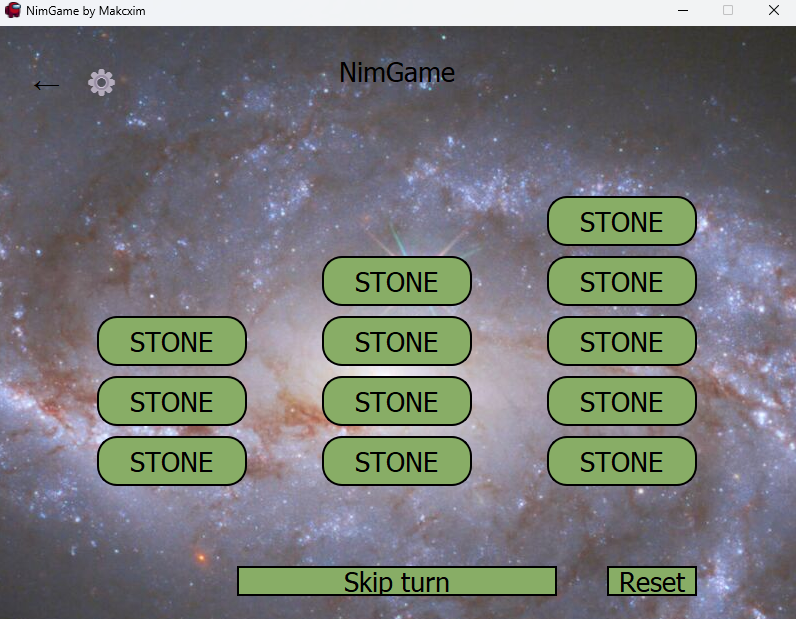

# NIM game with PyQt5

Play a NIM game with computer.
Choose who will start first.  
Choose the number of heaps and the number of items in each heap.  
Max number of heaps is 9, max number of items in heap is 6.  
You can play local solo.

# Installation
Clone the repo:
```console
git clone https://github.com/Makcxim/Nim-game
```
Install PyQt5:
```console
pip install PyQt5
```
Run the game:
```console
python main.py
```

# How to play

Press "Settings" button to change settings:  
1. Enter the number of items per each heap.  
2. Choose solo or non-solo mode. (In non-solo mode you will play with computer)
3. Choose who will start first.

Press "Play" button to start the game.
1. Press button "Stone" to grab it from heap.
2. You can take any number of stones but only from one heap.
3. Press "Reset" to reset current move.
4. Press "Skip turn" to end your turn.
5. To restart the game press unless end:  
press "⚙" - settings menu or "←" - start menu in left-up corner.  

# Rules
The game starts with several heaps of stones.  
Each player in turn takes stones from one of the heaps.  
The player who takes the last stone wins.  
The number of stones in each heap is set by the player.




# Preview
Main menu:  



Settings:



Game:



## TODO
- [ ] DESIGN... BRUH
